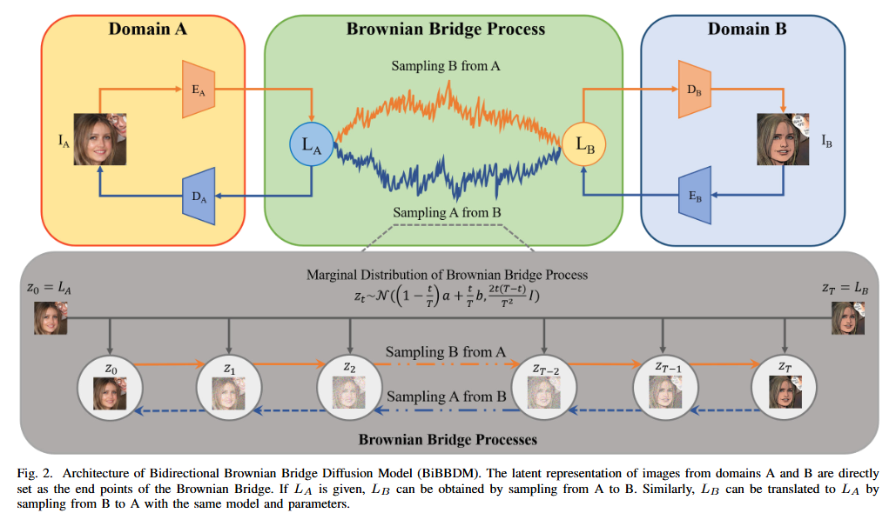

# Bidirectional Brownian Bridge Diffusion Models
***
#### BiBBDM: Bidirectional Image Translation with Brownian Bridge Diffusion Models
**Kaitao Xue, Bo Li, Ziyi Liu, Zhifen He, Bin Liu, Congxuan Zhang, Yu-Kun Lai**



## Requirements
```commandline
cond env create -f BiBBDM.yml
conda activate BBDM
```

## Data preparation
### Paired translation task
For datasets that have paired image data, the path should be formatted as:
```yaml
your_dataset_path/train/A  # training domain A
your_dataset_path/train/B  # training domain B
your_dataset_path/val/A    # validating domain A
your_dataset_path/val/B    # validating domain B
your_dataset_path/test/A   # testing domain A
your_dataset_path/test/B   # testing domain B
```
After that, the dataset configuration should be specified in config file as:
```yaml
dataset_name: 'your_dataset_name'
dataset_type: 'custom_aligned'
dataset_config:
  dataset_path: 'your_dataset_path'
```

### Colorization and Inpainting
For colorization and inpainting tasks, the references may be generated from ground truth. The path should be formatted as:
```yaml
your_dataset_path/train  # training ground truth
your_dataset_path/val  # validating ground truth
your_dataset_path/test  # testing ground truth
```

#### Colorization
For generalization, the gray image and ground truth are all in RGB format in colorization task. You can use our dataset type or implement your own.
```yaml
dataset_name: 'your_dataset_name'
dataset_type: 'custom_colorization or implement_your_dataset_type'
dataset_config:
  dataset_path: 'your_dataset_path'
```

#### Inpainting
We randomly mask 25%-50% of the ground truth. You can use our dataset type or implement your own.
```yaml
dataset_name: 'your_dataset_name'
dataset_type: 'custom_inpainting or implement_your_dataset_type'
dataset_config:
  dataset_path: 'your_dataset_path'
```

## Train and Test
### Specify your configuration file
Modify the configuration file based on our templates in <font color=violet><b>configs/template_config_file.yaml</b></font>

Don't forget to specify your VQGAN checkpoint path and dataset path.

### Specity your training and tesing shell
Specity your shell file based on our templates in <font color=violet><b>configs/template_config_file.sh</b></font>

change the path to your own VQGAN checkpoint
```yaml
dataset_name: 'your_dataset_name'
dataset_type: 'custom_inpainting or implement_your_dataset_type'
dataset_config:
  dataset_path: 'your_dataset_path'
```

If you wish to train from scratch
```commandline
python3 main.py --config configs/your_config.yaml --train --sample_at_start --save_top --gpu_ids 0,1,2,3 --sample_a2b --sample_b2a
```

If you wish to continue training, specify the model checkpoint path and optimizer checkpoint path in the train part.
```commandline
python3 main.py --config configs/your_config.yaml --train --sample_at_start --save_top --gpu_ids 0,1,2,3 --sample_a2b --sample_b2a --resume_model path/to/model_ckpt --resume_optim path/to/optim_ckpt
```

If you wish to sample the whole test dataset to evaluate metrics
```commandline
python3 main.py --config configs/your_config.yaml --sample_to_eval --gpu_ids 0,1,2,3 --sample_a2b --sample_b2a --resume_model path/to/model_ckpt
```

Note that optimizer checkpoint is not needed in test and specifying checkpoint path in commandline has higher priority than specifying in configuration file.


## VQGAN Checkpoints
For simplicity, we re-trained all of the models based on the same VQGAN model from LDM.

The pre-trained VQGAN models provided by LDM can be directly used for all tasks.  
https://github.com/CompVis/latent-diffusion#bibtex

The VQGAN checkpoint VQ-4,8,16 we used are listed as follows and they all can be found in the above LDM mainpage:

VQGAN-4: https://ommer-lab.com/files/latent-diffusion/vq-f4.zip  
VQGAN-8: https://ommer-lab.com/files/latent-diffusion/vq-f8.zip  
VQGAN-16: https://heibox.uni-heidelberg.de/f/0e42b04e2e904890a9b6/?dl=1

## Acknowledgement
Our code is implemented based on Latent Diffusion Model and VQGAN

[Latent Diffusion Models](https://github.com/CompVis/latent-diffusion#bibtex)  
[VQGAN](https://github.com/CompVis/taming-transformers)

<!-- ## Citation
```
@article{li2022vqbb,
  title={VQBB: Image-to-image Translation with Vector Quantized Brownian Bridge},
  author={Li, Bo and Xue, Kaitao and Liu, Bin and Lai, Yu-Kun},
  journal={arXiv preprint arXiv:2205.07680},
  year={2022}
```
} -->
